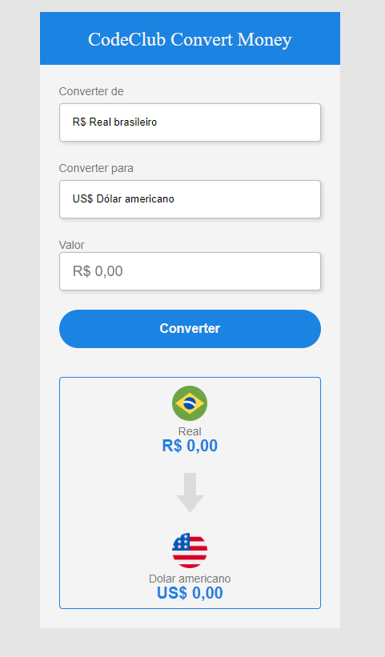

# currency-convert

> Esse conversor de moedas foi um trabalho estudantil, para testar o conteudo apresentado.

# Ajustes e melhorias

O projeto ainda está em desenvolvimento e as próximas atualizações serão voltadas nas seguintes tarefas:

- [ ] Converter as moedas com os valores atualizado diariamente

## 🤝 Colaboradores

Agradecemos às seguintes pessoas que contribuíram para este projeto:

<table> 
  <tr>
    <td align="center">
      <a href="#">
         
        
          <b>Eudes Barbosa</b>
        
      </a>
    </td>
    <td align="center">
      <a href="#">
         
        
          <b>Rodolfo Mori</b>
        
      </a>
    </td>
</tr>
</table>

[⬆ Voltar ao topo](#currency-convert) 
